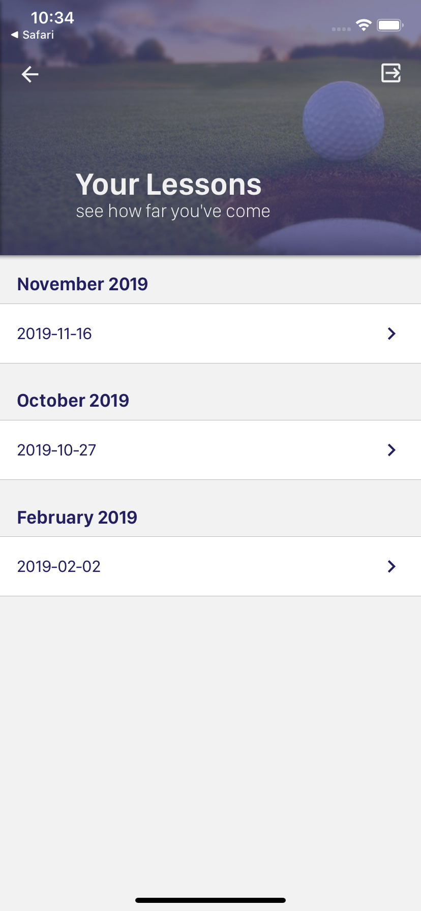
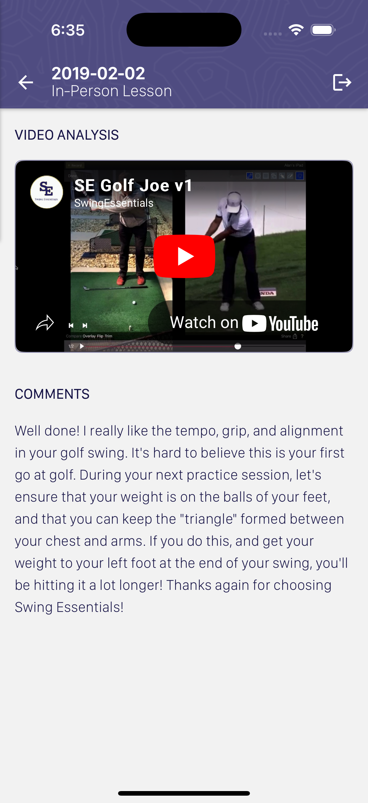
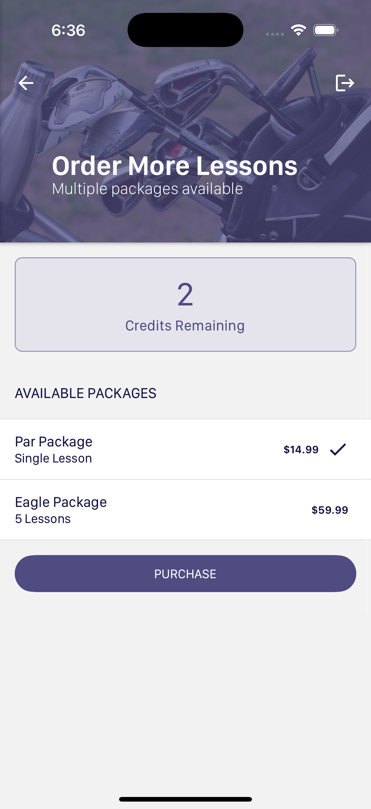
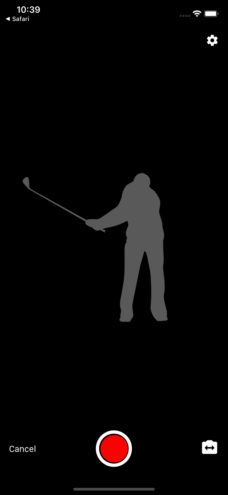
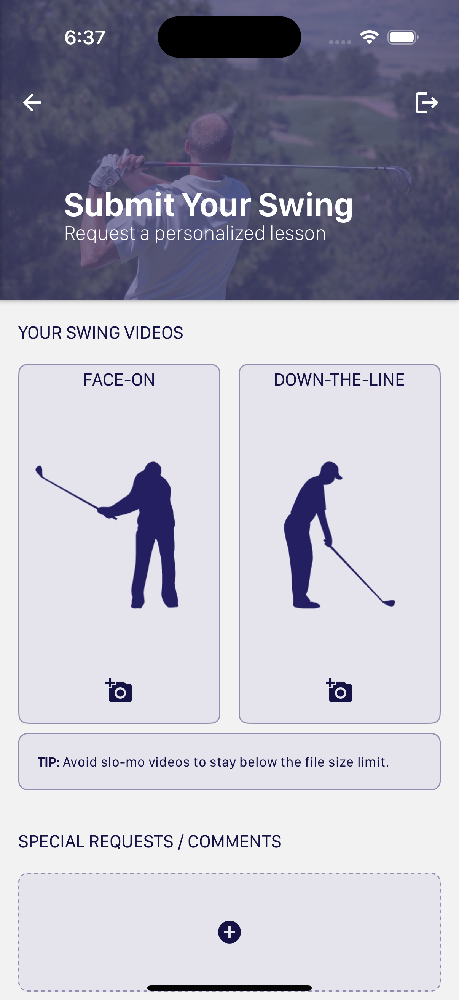

# Swing Essentials™ App (React-Native)
[Swing Essentials™](https://www.swingessentials.com) provides golfers with affordable, personalized video-based golf lessons. Golfers can submit short videos of their golf swing, and within 48-hours, they receive a personalized swing analysis video from a PGA-certified golf professional.


This project was bootstrapped using the [React Native CLI](https://github.com/react-native-community/cli) and takes advantage of the following libraries (many thanks to the contributors):
* [react-native-camera](https://github.com/react-native-community/react-native-camera)
* [react-native-elements](https://github.com/react-native-training/react-native-elements)
* [react-native-iap](https://github.com/dooboolab/react-native-iap)
* [react-native-image-picker](https://github.com/react-community/react-native-image-picker)
* [react-native-keychain](https://github.com/oblador/react-native-keychain)
* [react-native-modal](https://github.com/react-native-community/react-native-modal)
* [react-native-snap-carousel](https://github.com/archriss/react-native-snap-carousel)
* [react-native-splash-screen](https://github.com/crazycodeboy/react-native-splash-screen)
* [react-native-touch-id](https://github.com/naoufal/react-native-touch-id)
* [react-native-vector-icons](https://github.com/oblador/react-native-vector-icons)
* [react-native-video](https://github.com/react-native-community/react-native-video)
* [react-native-youtube](https://github.com/inProgress-team/react-native-youtube)


## Features
### Home
The home screen is the first screen you see when opening the app. It presents a dashboard giving you quick access to your latest lessons, latest tips, and new lesson creation.

### Lessons
The lessons page shows a list of your past/pending swing analysis videos. Clicking on a lesson row will open up the analysis.

Lessons | Analysis
---- | ----
 |  


### Order Credits
New users automatically receive a free credit to use to evaluate the Swing Essentials™ service. Additional credits can be purchased on the Order screen. Purchases are accomplished via in-app payments through Apple/Google.




### Submit a Swing
To submit a request for a swing analysis, users must provide a video of their swing in the "Face-On" and "Down-the-Line" view. They may select a video file from the existing videos on their device or choose to record a new video live.

There are several settings available if the user wishes to record a new swing from the app. They may set the desired duration of the recording as well as a delay period to give them time to set up prior to the recording. They may also choose to view a graphical overlay over their video to show them how they should stand for each required view.

Capture | Submit
---- | ----
 | 

### Tips / Blogs
Video tips (delivered monthly) can also be viewed through the app. Likewise, 19th Hole blog posts can also be viewed. Both are accessible from the main menu.

## Getting Started
To extend, update, or contribute to this project, clone the repository to your local machine and install the necessary dependencies (for final deployment, you will also need to install dev dependencies):

````
git clone https://github.com/joebochill/swingessentialsapp.git
cd swingessentialsapp
yarn install
````

You must have Android Studio (with necessary SDKs and tools installed) and/or Xcode available on your machine to deploy the application. If you have these properly installed, you should be able to open the respective /ios or /android project folders to run the projects. Alternatively, you could use the command line:

````
yarn ios
yarn android
````