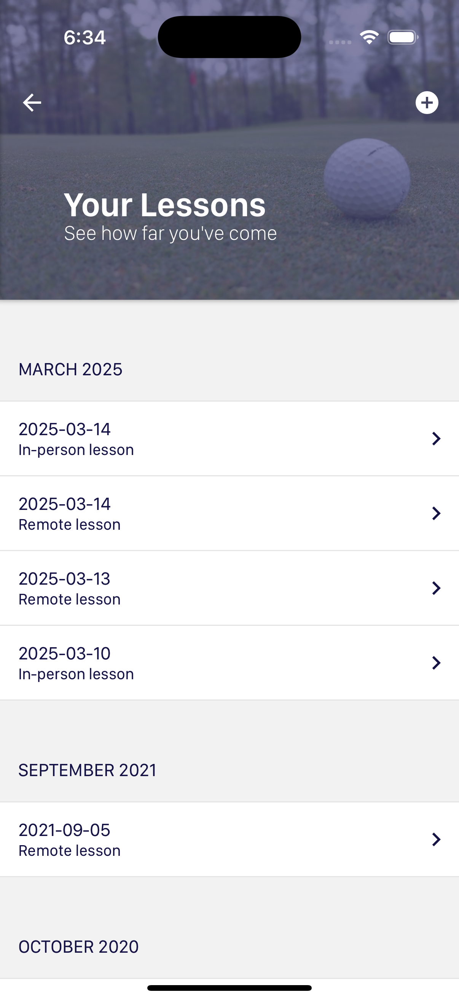
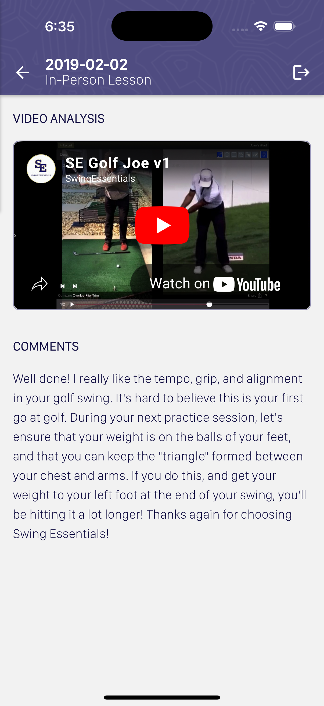
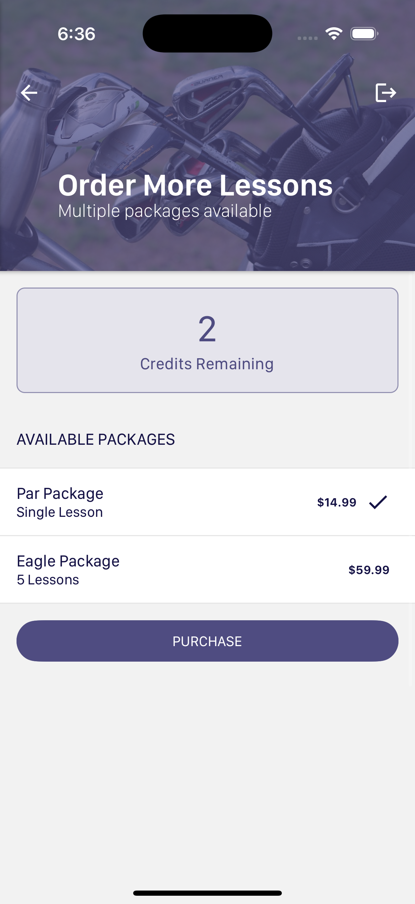
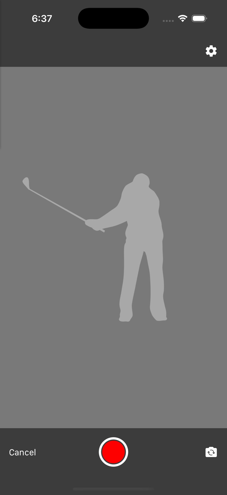
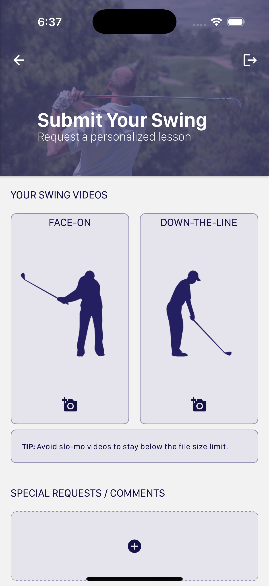

# Swing Essentials® App (React-Native / Expo)

[Swing Essentials®](https://www.swingessentials.com) provides golfers with affordable, personalized video-based golf lessons. Golfers can submit short videos of their golf swing, and within 48-hours, they receive a personalized swing analysis video from a PGA-certified golf professional.

This is an [Expo](https://expo.dev) project created with [`create-expo-app`](https://www.npmjs.com/package/create-expo-app). We take advantage of many different Expo plugins and other open source [libraries](./package.json) — many thanks to all of the contributors / maintainers.


## Features

### Home

The home screen is the first screen you see when opening the app. It presents a dashboard giving you quick access to your latest lessons, latest tips, and new lesson creation.

### Lessons

The lessons page shows a list of your past/pending swing analysis videos. Clicking on a lesson row will open up the analysis.

| Lessons                                                                | Analysis                                                                     |
| ---------------------------------------------------------------------- | ---------------------------------------------------------------------------- |
|  |  |

### Order Credits

New users automatically receive a free credit to use to evaluate the Swing Essentials® service. Additional credits can be purchased on the Order screen. Purchases are accomplished via in-app payments through Apple/Google.



### Submit a Swing

To submit a request for a swing analysis, users must provide a video of their swing in the "Face-On" and "Down-the-Line" view. They may select a video file from the existing videos on their device or choose to record a new video live.

There are several settings available if the user wishes to record a new swing from the app. They may set the desired duration of the recording as well as a delay period to give them time to set up prior to the recording. They may also choose to view a graphical overlay over their video to show them how they should stand for each required view.

| Capture                                                                    | Submit                                                                    |
| -------------------------------------------------------------------------- | ------------------------------------------------------------------------- |
|  |  |

### Tips / Blogs

Video tips (delivered monthly) can also be viewed through the app. Likewise, the 19th Hole blog posts can also be viewed. Both are accessible from the main menu.

## Getting Started

To extend, update, or contribute to this project, clone the repository to your local machine and install the necessary dependencies:

```
git clone https://github.com/joebochill/swingessentialsapp.git
cd swingessentialsapp
yarn install
```

Running the application is handled through a development build with Expo (Expo Go is not supported due to the use of native modules for various device functionality):

```
yarn android
yarn ios
```

## Building / Deploying

You can build a production version of the application with EAS by running:

```
yarn prebuild
yarn build:android
yarn build:ios
```

You can find the build assets in Expo, where they can be downloaded and submitted to the appropriate app store.
